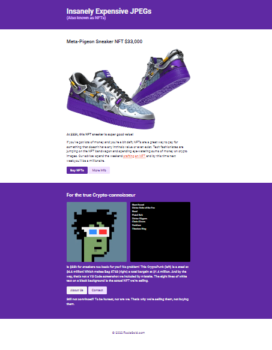
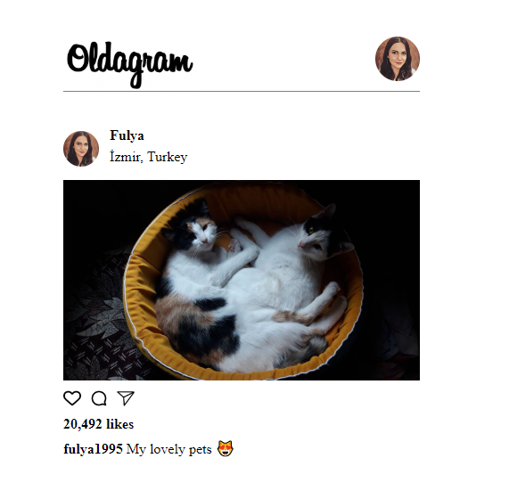

## Table of contents

- [Overview](#overview)

- [Projects](#projects)

  - [1-NFT Site App](#nft-site)
  - [2-Coworking Space Site App](#space-site)
  - [3-Solo Project: Oldagram App](#oldagram-site)

  ## Overview

  Completed these projects that are parts of [Scrimba](https://scrimba.com/learn/frontend/)'s Essential CSS Concepts.  I mastered HTML/CSS and JavaScript in these projects.
  You can see the visual representations of the each app below.

  ## Projects

  ### 1-NFT Site App
  
  ## Description
  ```bash
  - The project is designed to list NFT sneakers 
  ```

  ### Visulation of the App


  


 
  ### 3-Solo Project: Oldagram App
  
    ## Description
  ```bash
  - The project is designed for online photo-sharing and social network platform 
  ```
  
  ### Visulation of the App 
  ### [Live Link:](https://scrimba-oldagram-app.netlify.app/)

    
    

  ### Stretch Goals: COMPLETED ✅

  - Create the first post ✅
  - Use semantic HTML ✅
  - Add hover effects to the icons ✅
  
  
