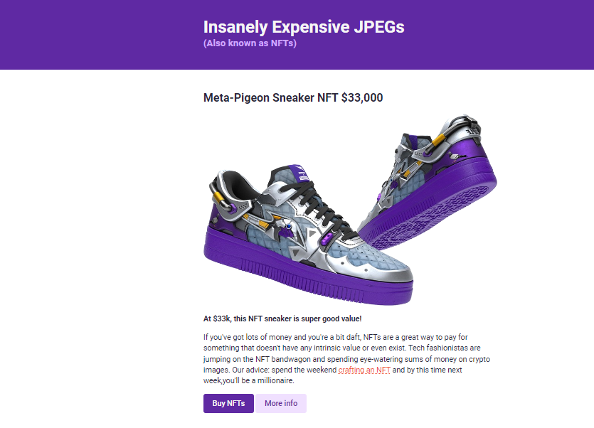

## Table of contents

- [Overview](#overview)

  - [Description](#description)
- [Projects](#projects)

  - [1-NFT Site App](#nft-site)

  ## Overview

  ### Description

  Completed these projects that are parts of [Scrimba](https://scrimba.com/learn/frontend/)'s Essential CSS Concepts.  I mastered HTML/CSS and JavaScript in these projects.
  You can see the visual representations of the each app below.

  ## Projects

  ### 1-NFT Site App

  ### Visulation of the App

  
